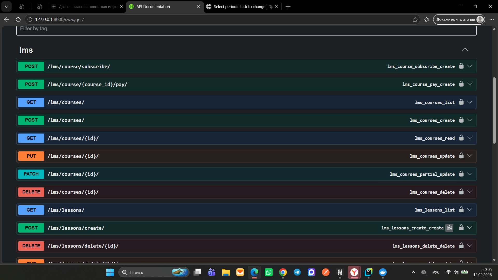
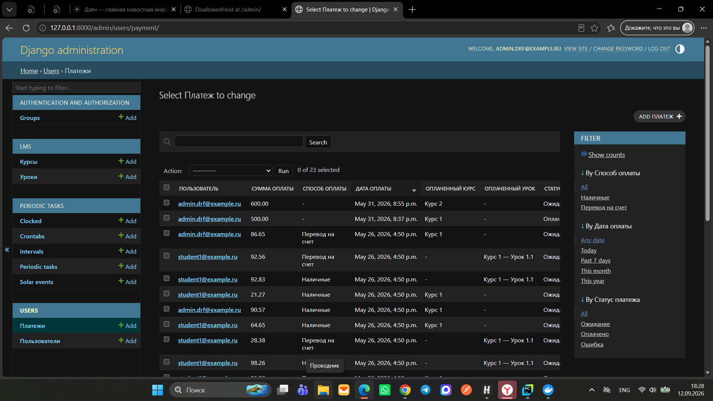
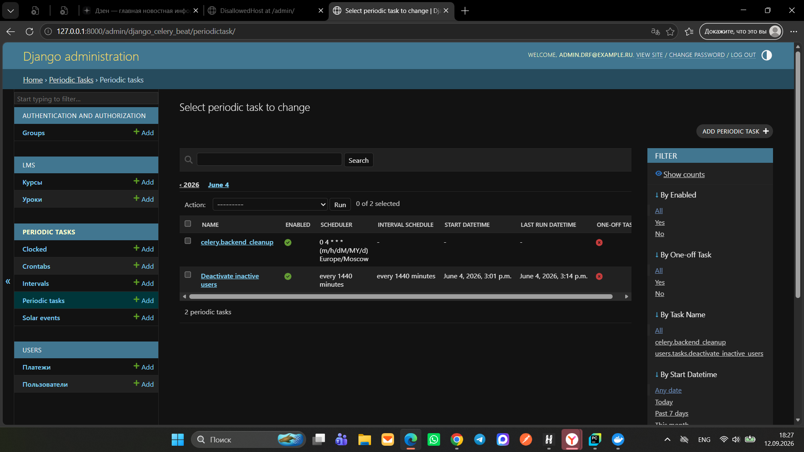
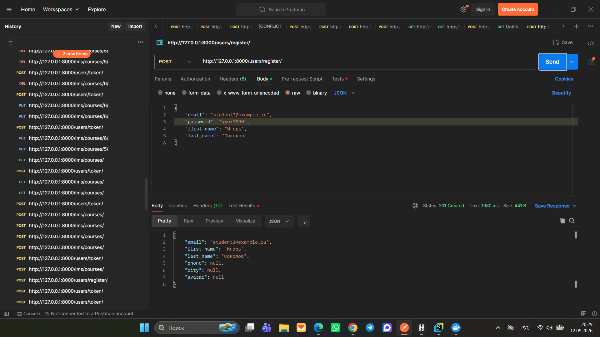
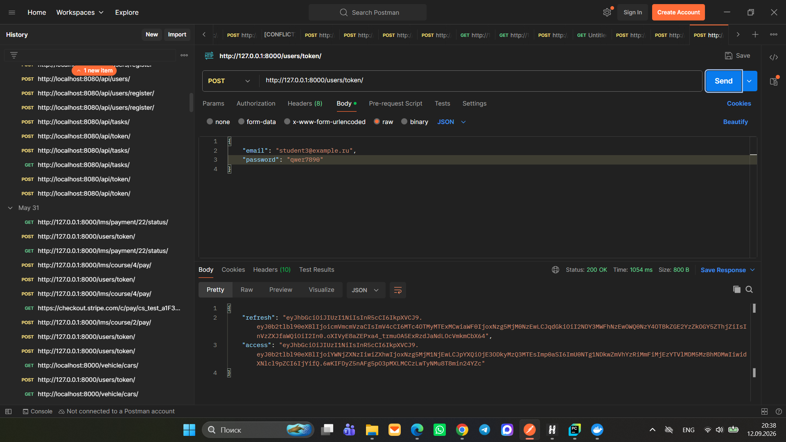
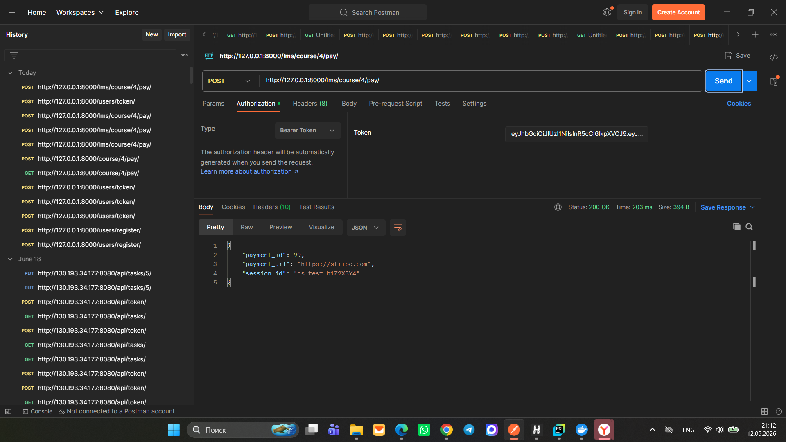
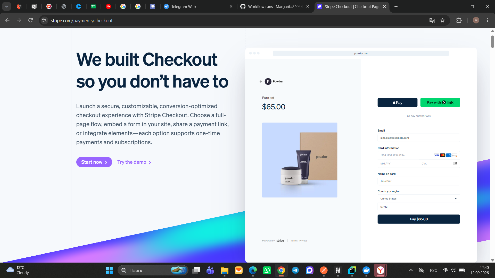

# 🚀 LMS API (Learning Management System)

[](https://github.com)

Бэкенд-сервис для управления образовательной платформой (онлайн-школой). Реализован на Django REST Framework и
предоставляет REST API для управления курсами, уроками, подписками и профилями пользователей, включая фоновую
автоматизацию на Celery и приём платежей через Stripe.

---

## 📌 Содержание

- 🧩 [Описание и возможности](#описание-и-возможности)
- 🛠 [Технологии](#технологии)
- 🏁 [Локальный запуск](#локальный-запуск)
  - [С использованием Docker](#с-использованием-docker)
  - [Без Docker (ручной запуск)](#без-docker-ручной-запуск)
- 🔐 [Переменные окружения](#переменные-окружения-env)
- 📚 [API Эндпоинты](#api-эндпоинты)
- 🧪 [Тестирование API](#тестирование-api)
- 📊 [Демонстрация работы проекта](#демонстрация-работы-проекта)
- 📁 [Статические и медиа-файлы](#статические-и-медиа-файлы)
- 👩‍💻 [Автор](#автор)

---

## 🧩 Описание и возможности

Проект предоставляет полноценный функционал для LMS-платформ:
- **Кастомная модель пользователя:** Авторизация по `email`, расширенные профили (телефон, город, аватар).
- **Управление контентом:** Полный цикл CRUD для курсов (ViewSets) и уроков (Generics).
- **Права доступа:** Ограничение видимости объектов (пользователи взаимодействуют только со своими данными) и роли для модераторов.
- **Интеграция со Stripe:** Автоматическое создание продуктов/цен на стороне платежного шлюза и выдача сессионных ссылок для оплаты.
- **Асинхронные задачи (Celery):** Фоновые рассылки email-уведомлений об обновлениях и периодический трекинг активности (Celery Beat)
- для деактивации профилей, отсутствовавших более 30 дней.

---

## 🛠 Технологии

- **Python 3.13** + **Poetry** (управление зависимостями)
- **Django 6.0.5** + **Django REST Framework 3.17.1**
- **PostgreSQL** + **psycopg2-binary**
- **Celery** + **Redis** (брокер и менеджер очередей)
- **Stripe SDK** (онлайн-транзакции)
- **drf-yasg** (автогенерация Swagger/ReDoc)
- **Pillow** (обработка превью и аватаров)
- **Docker** + **Docker Compose**
- **GitHub Actions** (CI/CD автоматизация)

---

## 🏁 Локальный запуск

### С использованием Docker (рекомендуется)

1. **Клонируйте репозиторий и перейдите в папку проекта:**
```bash
git clone https://github.com/Margarita2405/lms-api
cd lms-api
```

2. **Создайте файл .env в корне проекта:**
Скопируйте пример настроек и заполните переменные актуальными ключами (Stripe, пароли БД):
```bash
cp .env.example .env
```

3. **Запустите контейнеры:**
```bash
docker-compose up --build
```
*Эта команда соберёт образы, поднимет и изолирует контейнеры Django, PostgreSQL и Redis.*

4. **Примените миграции базы данных:**
```bash
docker-compose exec web python manage.py migrate
```

5. **Создайте суперпользователя для доступа в панель администратора:**
```bash
docker-compose exec web python manage.py createsuperuser
```

6. **Для остановки сервисов используйте:**
```bash
docker-compose down
```

### Без Docker (ручной запуск)

1. **Разверните виртуальное окружение и установите зависимости через Poetry:**
```bash
poetry shell
poetry install
```
2. **Создайте локальную базу данных PostgreSQL с именем `django_drf`.**

3. **Выполните миграции и запустите локальный веб-сервер:**
```bash
python manage.py migrate
python manage.py runserver
```
API станет доступно по адресу: http://127.0.0.1:8000.

---

## 🔐 Переменные окружения (.env)

Настройте конфигурационный файл `.env` в корневом каталоге по следующему шаблону:

```text
SECRET_KEY=your_secret_key_here
DEBUG=True

# Настройки PostgreSQL для Django
DATABASE_NAME=django_drf
DATABASE_USER=postgres
DATABASE_PASSWORD=your_db_password
DATABASE_HOST=db
DATABASE_PORT=5432

# Настройки PostgreSQL для контейнера базы данных
POSTGRES_DB=django_drf
POSTGRES_USER=postgres
POSTGRES_PASSWORD=your_db_password

# Очереди задач и брокер
REDIS_URL=redis://redis:6379/0

# Интеграция с платежным шлюзом
STRIPE_API_KEY=your_stripe_test_key
STRIPE_API_URL=https://stripe.com
```

---

## 📚 API Эндпоинты

### Модуль курсов (`/lms/courses/`)

| Метод | URL | Описание |
| :--- | :--- | :--- |
| **GET** | `/lms/courses/` | Получение списка всех курсов и вложенных уроков |
| **POST** | `/lms/courses/` | Создание нового обучающего курса |
| **GET** | `/lms/courses/{id}/` | Детальная информация по конкретному курсу |
| **PUT/PATCH** | `/lms/courses/{id}/` | Обновление параметров или описания курса |
| **DELETE** | `/lms/courses/{id}/` | Полное удаление курса из системы |

### Модуль уроков (`/lms/lessons/`)

| Метод | URL | Описание |
| :--- | :--- | :--- |
| **GET** | `/lms/lessons/` | Список всех доступных пользователю уроков |
| **POST** | `/lms/lessons/create/` | Создание урока (обязательные поля: `title`, `course`) |
| **GET** | `/lms/lessons/{id}/` | Просмотр детальной информации об уроке |
| **PUT/PATCH** | `/lms/lessons/update/{id}/` | Редактирование материалов урока |
| **DELETE** | `/lms/lessons/delete/{id}/` | Удаление урока из базы данных |

### Профили и авторизация пользователей

| Метод | URL | Описание |
| :--- | :--- | :--- |
| **POST** | `/users/register/` | Регистрация нового аккаунта на платформе |
| **POST** | `/users/token/` | Аутентификация и генерация пары JWT-токенов |
| **POST** | `/users/token/refresh/` | Обновление просроченного `access`-токена |
| **GET** | `/users/profile/{id}/` | Просмотр информации профиля пользователя |
| **PUT/PATCH** | `/users/profile/{id}/` | Модификация данных (телефон, город, аватар) |

---

## 🧪 Тестирование API

Для проверки работоспособности модулей, механизмов валидации, подписок и прав доступа (Permissions) написан
обширный пул модульных тестов.

**Запуск тестов в Docker-окружении:**
```bash
docker-compose exec web python manage.py test
```

**Локальный запуск тестов:**
```bash
python manage.py test
```

---

## 📊 Демонстрация работы проекта

### 1. Документация API (Swagger)
Автоматически сгенерированная интерактивная схема всех эндпоинтов системы для удобного тестирования и интеграции бэкенда с фронтендом.


### 2. Панель администратора Django
Централизованный интерфейс администрирования сущностей: управление курсами, уроками и агрегация данных пользователей.


### 3. Менеджер периодических задач (Celery Beat)
Оцифровка бизнес-логики: демонстрация зарегистрированных фоновых задач, включая автоматический ежедневный скрипт контроля активности пользователей `Deactivate inactive users`.


### 4. Регистрация нового пользователя (POST `/users/register/`)
Процесс создания аккаунта в Postman. Конфиденциальные данные (пароли) хэшируются на уровне СУБД перед сохранением.


### 5. Аутентификация по протоколу JWT (POST `/users/token/`)
Клиент отправляет верифицированные email/пароль и получает в ответ ключи `access` и `refresh` для доступа к защищенным эндпоинтам.


### 6. Интеграция со Stripe: Выставление счёта (POST `/lms/course/{id}/pay/`)
При обработке запроса бэкенд связывается со Stripe API, динамически создает продукт и генерирует для клиента безопасную уникальную ссылку `payment_url`.


### 7. Тестовая форма оплаты Stripe в браузере
Защищенный внешний интерфейс Stripe Checkout, на который перенаправляется пользователь для безопасного завершения транзакции по карте.


---

## 📁 Статические и медиа-файлы

- Статические файлы (конфигурации CSS, JS для админки) собираются в автоматическом режиме в директорию `static/`.
- Пользовательский медиа-контент (изображения курсов, аватары профилей) загружается и изолируется в каталоге `media/`.

---

## 👩‍💻 Автор

**Маргарита Буршева**
- **Email:** mbursheva@mail.ru
- **GitHub Проект:** [lms-api](https://github.com)

*Дипломный проект в рамках углубленного курса Университета Skypro «Django REST Framework».*
